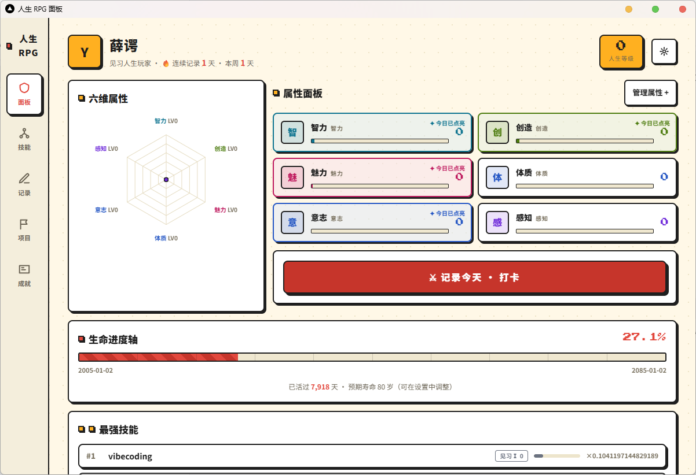

# Soloup - 人生 RPG 面板

把你投入在各项技能上的**每日行为**，通过一套可解释的数学模型，转换成**技能等级 → 属性面板 → 成就卡牌**的成长反馈；同时开放本地 MCP 服务，让 AI 能代为查询与管理这个面板。



## 功能

- **技能管理** — 创建技能、每日打卡记录投入时间，自动计算等级与熟练度
- **属性派生** — 属性完全由技能加权派生，无需手工维护
- **技能树** — 可视化技能关联与前置关系，支持拖拽排序
- **成就系统** — 可见成就（明确目标）+ 隐藏成就（神秘解锁）
- **项目轴** — 按项目维度组织技能与记录
- **每日提醒** — 可配置时间的原生通知打卡提醒
- **数据导入/导出** — JSON 全量备份与恢复
- **MCP 服务** — 本地 MCP server，AI 可查询和管理面板数据（41 个工具）
- **系统托盘** — 关闭窗口时最小化到托盘，后台持续运行

## 技术栈

| 层 | 技术 |
|---|---|
| 前端 | Next.js 15 (static export) + React 19 + Tailwind CSS 4 + TanStack Query |
| 后端 | Rust — soloup-core / soloup-store / soloup-solver / soloup-server / soloup-mcp |
| 桌面 | Tauri v2 (WebView2) |
| 数据库 | SQLite (单文件，本地存储) |
| CI/CD | GitHub Actions (Windows NSIS 自动构建) |

## 项目结构

```
soloup/
├── apps/web/            # Next.js 前端
├── backend/
│   └── crates/
│       ├── soloup-core/      # 领域模型与不变量
│       ├── soloup-store/     # SQLite Repository
│       ├── soloup-solver/    # 数值计算引擎
│       ├── soloup-server/    # JSON-RPC 服务 (sidecar)
│       └── soloup-mcp/       # MCP 服务 (sidecar)
├── src-tauri/           # Tauri 桌面壳
├── scripts/             # 构建脚本
└── docs/                # 技术规格文档
```

## 开发

### 前置要求

- Node.js >= 22
- pnpm >= 10
- Rust (stable)
- [Tauri v2 系统依赖](https://v2.tauri.app/start/prerequisites/)

### 安装与运行

```bash
pnpm install

# 构建后端 sidecar
cd backend && cargo build --release -p soloup-server -p soloup-mcp && cd ..

# 复制 sidecar 到 resources
node scripts/copy-sidecars.mjs

# 启动 Tauri 开发模式
cargo tauri dev
```

### 常用命令

```bash
pnpm build              # 构建前端
pnpm build:backend      # 构建后端 sidecar
pnpm typecheck          # TypeScript 类型检查
pnpm test               # 运行测试
pnpm lint               # ESLint 检查
pnpm format             # Prettier 格式化
```

## 构建安装包

```bash
pnpm build:dist
```

产物位于 `src-tauri/target/release/bundle/nsis/`。

可选：使用 UPX 压缩主 exe 并重建 NSIS 安装包：

```bash
pnpm build:upx
```

## CI/CD

推送 `v*` tag 自动触发 GitHub Actions 构建，产物发布到 [Releases](https://github.com/Roxy-DD/soloup/releases)。

```bash
git tag v0.1.0
git push origin v0.1.0
```

